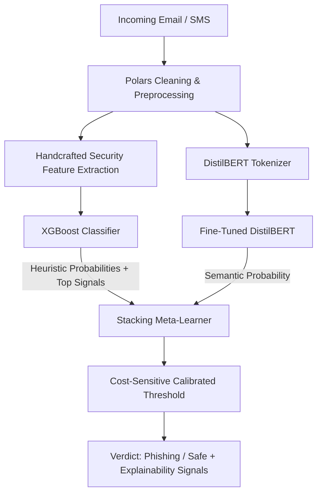

# PhishGuard: Production-Grade Phishing & Smishing Detection System

[](https://phishing-smishing-detector-ui.vercel.app/)
[](https://phishing-smishing-detector.onrender.com/docs)
[](https://www.python.org/downloads/)
[](https://pytorch.org/)
[](https://huggingface.co/)
[](https://pola.rs/)
[](https://fastapi.tiangolo.com/)
[](LICENSE)

> 🌐 **Live Web Application (Vercel):** [https://phishing-smishing-detector-ui.vercel.app/](https://phishing-smishing-detector-ui.vercel.app/)  
> ⚡ **Live Cloud API & Interactive Docs (Render):** [https://phishing-smishing-detector.onrender.com/docs](https://phishing-smishing-detector.onrender.com/docs)

An enterprise-ready, multimodal NLP and tabular ensemble system designed to detect adversarial phishing emails and smishing attacks with high precision and explainability. Built around real-world cybersecurity risk signals, rigorous zero-leakage deduplication, and cost-weighted threshold calibration.

---

## 📌 Executive Summary & Architecture

Modern spear-phishing and smishing campaigns bypass traditional keyword filters using obfuscation, subtle domain spoofing, and LLM-assisted evasive phrasing. **PhishGuard** combines:
1. **Fine-Tuned Transformer (DistilBERT)**: Captures semantic context, latent intent, and linguistic manipulation patterns.
2. **Security Signal Feature Extractor & Gradient Boosting (XGBoost)**: Analyzes structural signals including URL entropy, punycode/IP presence, lexical ratios, urgency keyword density, and special character signatures.
3. **Stacked Meta-Learner (Logistic Regression on Out-of-Fold Val)**: Ensembles probabilistic outputs to achieve lower false positive rates on corporate communication than either model alone.
4. **Explainable AI (SHAP & Token Saliency)**: Returns real-time attribution signals for security operations center (SOC) analysts.



---

## 🎯 Key Engineering Highlights

- **Zero-Leakage Guarantee**: Global text normalization and cross-corpus deduplication with Polars before train/val/test splitting. In evaluation, **12,017 near-duplicate emails** were identified and purged from historical benchmarking sets to prevent data leakage.
- **Realistic Evaluation (PR-AUC > Accuracy)**: In production email filtering, legitimate comms vastly outnumber phishing lures. Models are evaluated using **Precision-Recall AUC (PR-AUC)**, ROC-AUC, and operating points configured for low false alarms.
- **Out-of-Distribution (OOD) & Channel-Shift Robustness**: Benchmarked against held-out corpora (SpamAssassin, Nazario, Enron) and an SMS smishing test slice to explicitly quantify distribution shift.
- **Adversarial Resilience**: Evaluated against LLM-generated phishing lures that deliberately omit traditional spam triggers.
- **Full Stack Production Serving**: Packaged behind a high-throughput **FastAPI** microservice with **React** front-end.

---

## 📊 Benchmark Results (Ablation Table)

All metrics are computed on held-out test splits without tuning on test sets:

| Model | In-Domain PR-AUC | In-Domain F1 | Test Recall | OOD Email PR-AUC | OOD Email F1 | SMS Shift PR-AUC |
| :--- | :---: | :---: | :---: | :---: | :---: | :---: |
| **TF-IDF + Logistic Regression (Baseline)** | 0.9954 | 0.9732 | 0.9702 | 0.9753 | 0.9142 | 0.3394 |
| **Tabular Heuristics (XGBoost)** | 0.8326 | 0.7265 | 0.6653 | 0.8148 | 0.6153 | 0.1591 |
| **Fine-Tuned DistilBERT** | 0.9972 | 0.9779 | 0.9774 | 0.9848 | 0.9274 | 0.4605 |
| **Stacked Ensemble (Default @ 0.50)** | **0.9958** | **0.9846** | **0.9836** | **0.9798** | **0.9312** | **0.3734** |
| **Stacked Ensemble (Cost-Tuned @ 0.07)** | **0.9958** | **0.9739** | **0.9959** | **0.9798** | **0.9552** | **0.3734** |

> *At threshold `0.070` (penalizing missed phish 5x), test recall reaches **99.59%**, catching virtually all phishing attempts while maintaining high precision (`95.28%`). On OOD email, F1 rises from `0.9312` to `0.9552`.*

---

## 🔬 Security Feature Engineering

The tabular pipeline extracts domain-informed heuristics:
- **URL Dynamics**: URL count, maximum URL length, IP address as host detection, `@` and hyphen frequencies, domain entropy.
- **Lexical Signals**: Uppercase-to-lowercase ratio, digit density, exclamation / question mark density.
- **Social Engineering Keywords**: Urgency indicators (`verify`, `suspended`, `immediate`, `unauthorized`, `password`, `OTP`, `KYC`, `blocked`).
- **Domain Shorteners**: Detection of redirection services (`bit.ly`, `tinyurl`, `t.co`, etc.).

---

## 🛠️ Repository Structure

```bash
Phishing-Smishing-Detector/
├── .github/workflows/
│   └── ci.yml               # GitHub Actions automated CI testing
├── api/
│   └── main.py              # Production FastAPI REST microservice
├── data/                    # Cleaned & processed parquet splits
├── models/
│   ├── baseline_tfidf_lr.joblib
│   ├── xgb_features.joblib
│   └── meta_learner.joblib
├── notebooks/
│   └── phishing_smishing_detector_pipeline.ipynb # Full Kaggle training notebook
├── reports/
│   ├── ablation.md          # Empirically measured ablation table
│   └── figures/             # PR curves, calibration & SHAP plots
├── src/
│   ├── data.py              # Zero-leakage Polars cleaning & deduplication
│   ├── features.py          # 12 handcrafted cybersecurity heuristics
│   ├── train_tabular.py     # TF-IDF & XGBoost with 5-fold CV
│   ├── train_text.py        # DistilBERT fine-tuning script
│   ├── ensemble.py          # Stacking meta-learner & threshold calibration
│   ├── evaluate.py          # PR-AUC, ROC-AUC, F1 & metrics logger
│   └── adversarial.py       # Evasive lure benchmarks & error analysis
├── tests/
│   ├── test_api.py          # FastAPI endpoint contract tests
│   └── test_data.py         # Automated zero-leakage assertions
├── ui/                      # React + Vite dark-mode frontend
├── Dockerfile               # Container definition for cloud deployment
├── requirements.txt         # Pinned python dependencies
└── README.md
```

---

## 🚀 Quickstart

### 1. Installation
```bash
git clone git@github.com:gyanranjan1717/Phishing-Smishing-Detector.git
cd Phishing-Smishing-Detector
python -m venv venv
source venv/bin/activate  # On Windows: venv\Scripts\activate
pip install -r requirements.txt
```

### 2. Verify Zero-Leakage Tests
```bash
pytest -v tests/
```

### 3. Run Inference API Locally
```bash
uvicorn api.main:app --host 0.0.0.0 --port 8000 --reload
```

---

## 📝 Author & Attribution
Developed by **Gyan Ranjan** as a portfolio project showcasing production AI engineering for cybersecurity threat detection.
